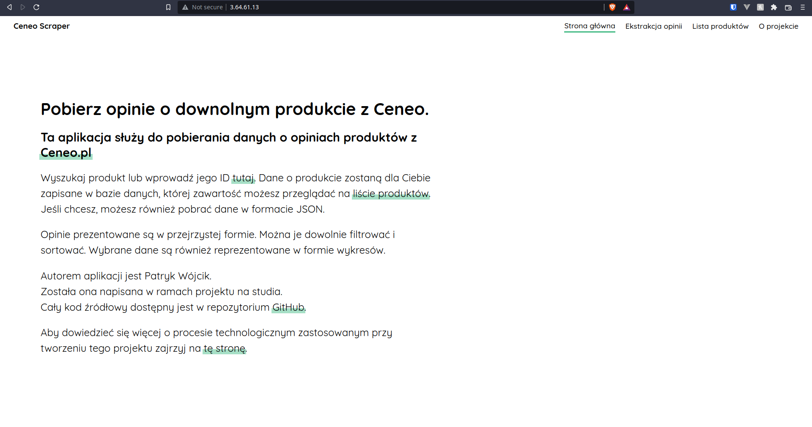

# Automatic Flask app installation with Ansible

## How to install
1. Create two EC2 instances.
2. Copy their IPs to `hosts.ini`. One of those instances will be a proxy server.
3. In `setup.yaml` change `APP_REPO` and `APP_NAME` to your application.
4. Change `app_ids` to your `proxy_nodes` private IP followed by `:8080`.
5. Run ```ansible-playbook -i hosts.ini setup.yaml``` to deploy your application.
6. Connect through your `proxy_nodes` IP address in your favourite browser.

## How it works
`setup.yaml` downloads all required dependecies (pip, git, nginx).
It then clones git repository provided in `APP_REPO` variable. In the next step a new user is created to run your application. After that it creates a python virtual environment and installs dependencies of your Flask app. Your application is run through a systemd service on port 8080. Remember to set correct name of your application in `APP_NAME` variable otherwise this service won't be able to start.

`setup.yaml` also creates a proxy server using nginx. Server is listening on port 80 and forwards all HTTP request to the ip provided in `app_ids` variable.

## Proof that it works

